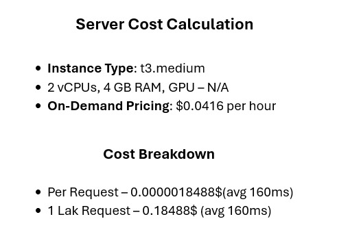
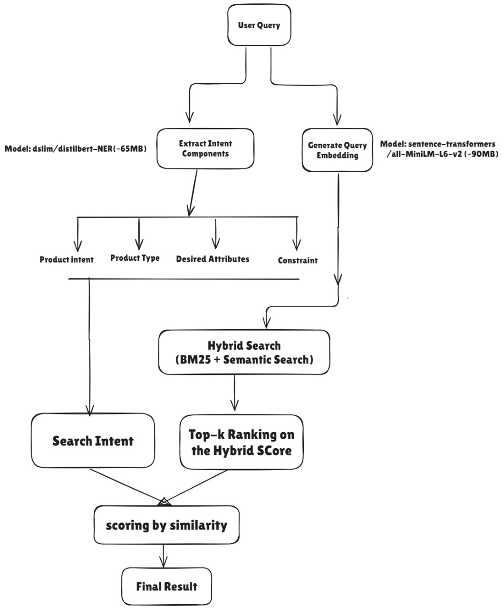

# Intent_Based_Search

## Tech Stack & Tools
- FastAPI (Python)
- Qdrant (Vector Database)
- Intent Classification Model (dslim/distilbert-NER) - 768 dimension ~65MB
- Semantic Search Model (sentence-transformers/all-MiniLM-L6-v2) - 384 dimension ~90MB
- Hybrid Search (BM25 + Semantic Search)

### Server & Cost Calculation

### Query Diagram

## Local Setup(linux)
#### Start database
- docker compose -f docker-compose.database.yml up -d

#### change terminal directory
- cd backend

#### create virtual environment
- make venv && source venv/bin/activate

#### install dependencies
- make install

#### run app
- make dev

#### deactivate virtual environment
- deactivate

<!-- #### data store in qdrant - text -> embedding -> vector database
- python init_data.py -->
